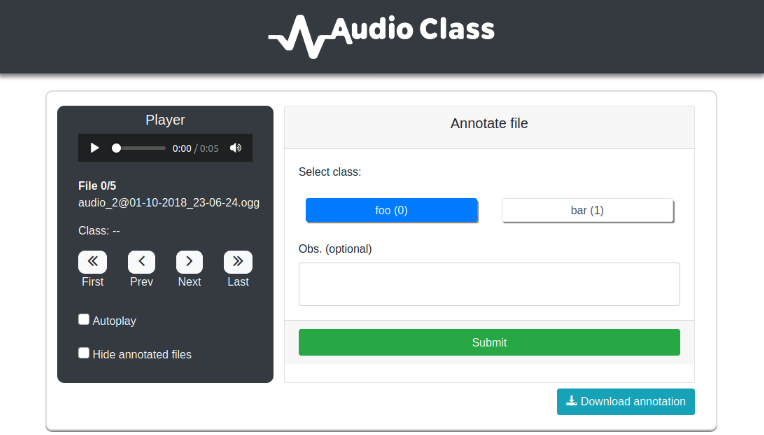
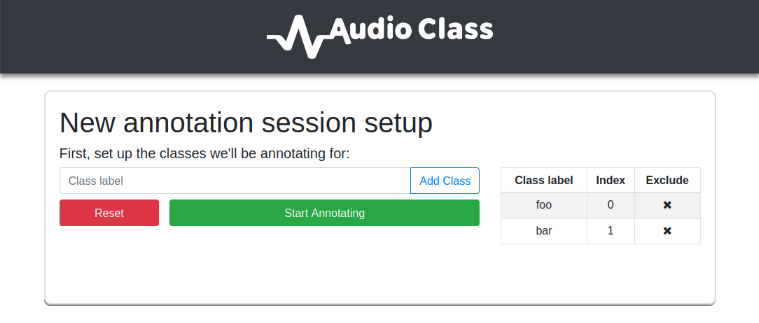

<!--
*** github_username, repo, twitter_handle, email
-->


<!-- PROJECT SHIELDS -->
<!--
*** I'm using markdown "reference style" links for readability.
*** Reference links are enclosed in brackets [ ] instead of parentheses ( ).
*** See the bottom of this document for the declaration of the reference variables
*** for contributors-url, forks-url, etc. This is an optional, concise syntax you may use.
*** https://www.markdownguide.org/basic-syntax/#reference-style-links
-->
[![MIT License][license-shield]][license-url]

<!-- PROJECT LOGO -->
<br />
<p align="center">
  <a href="https://github.com/glefundes/audio-class-annotation-tool">
    
  </a>
  <p align="center">
    A simple, straightforward tool for class annotation of audio files
  </p>
</p>


<!-- TABLE OF CONTENTS -->
## Table of Contents

* [About the Project](#about-the-project)
  * [Built With](#built-with)
* [Getting Started](#getting-started)
  * [Prerequisites](#prerequisites)
  * [Installation](#installation)
* [Usage](#usage)
* [License](#license)
* [Contact](#contact)
* [Acknowledgements](#acknowledgements)


<!-- ABOUT THE PROJECT -->
## About The Project
<p align="center">
    
</p>

This project came to life when I was messing around with a prototype of a neural network for audio classification. I needed a way to annotate some scrapped data that I collected, but was too lazy to open each of the hundreds of files and manually write down their respective classifications. 

While there are some great audio annotation tools out there with great features such as diarization, waveform visualization, speaker identification, etc, all I needed was a quick and dirty way to separate audio files in classes.

If you need complex annotation features, checkout some projects such as [Audino](https://github.com/midas-research/audino), [audio-annotator](https://github.com/CrowdCurio/audio-annotator) and [dynitag](https://github.com/dynilib/dynitag). If, like me, you want a simple way to classify your data with minimal setup, AudioClass is here for you :)

### Built With

* [Flask]()
* [Bootstrap-Flask]()
* [JQuery]()

<!-- GETTING STARTED -->
## Getting Started

To get up and running with AudioClass, here's what you need to do:

### Prerequisites

AudioClass is developed in a linux environment using the Flask framework with Python 3.7, and tested to run on Firefox. It should work with other browsers, but I don't offer any guarantees.

### Installation
 
1. Clone the repo
```sh
git clone https://github.com/glefundes/audio-class.git
```
2. Create and activate a virtual environment (Recommended)
```sh
cd audio-class/
python3 -m venv venv
source venv/bin/activate
```
3. Install dependencies
```sh
pip install -r requirements.txt
```

<!-- USAGE EXAMPLES -->
## Usage

### Audio files
Currently the system is limited to recognize .mp3, .wav, and .ogg files. It may work with other formats but it's not tested. You can try by adding new extensions to the [accepted formats list here](https://github.com/glefundes/audio-class/blob/master/app/utils.py#L7).

To expose your data to the app, move all the audio files you wish to annotate to the `audio_data/` folder located in the project's root

### Lauching the app
To launch the local flask server and startup AudioClass just cd into the project's root and:
```sh
flask run
```
Now just navigate to `localhost:5000/` in your browser and you're set :)

### Setting up an annotation session
In the startup menu, click 'New Session' and the class setup prompt will appear. You need to setup at least 2 unique class labels in order to begin annotating.
<p align="center">
    
</p>

### Annotating files
In the [main app screen](#about-the-project) you can navigate through the audio files in the data folder and play them. Select the class to which they belong and submit. The annotation will be recorded and the next file will be loaded automatically.

Current relevant features are:
* Speedy mouse-less annotation: navigate through classes using the right and left arrow keys and submit with the Enter key
* Autoplay checkbox: start to play next audio automatically so you don't have to click play everytime you submit 
* Optional observation field: Write something about a particular file so you can remember and find it later without having to inturrupt the session
* Hide already annotated file checkbox: display only files without existing annotations in the current session. Useful to track progress or when loading a previous unfinished session.

### Saving and loading annotation sessions

When you are done or simply want to take a break, click the 'Download annotation' button to download a .json file with all the files you just annotated. The file has the following format:
```
{
    "classes": [
        {
            "class_label": "foo",
            "index": 0
        },
        {
            "class_label": "bar",
            "index": 1
        }
    ],
    "files": [
        {
            "class": 0,
            "file": "filename.ogg",
            "obs": "isn't this a a cool tool? ;)"
        }
    ]
}
```

To load and resume a session, click on 'Load previous session' when you start up AudioClass and upload the .json file you downloaded.
(All the files from the original session must still be present in the data folder for the session resuming to work!)

<!-- CONTRIBUTING -->
## Contributing

Being mainly a ML engineer involved in computer vision projects, I don't claim to be a profficient web developer in any way. I can almost guarantee this project has it's share of inneficiencies, is built with a few bad practices and probably the occasional bug. Feel free to open issues if you encounter unexpected behaviour or to fork/issue a pull request If you wish to contribute by improving the existing code or adding new features. Yay for open source software!

<!-- LICENSE -->
## License

Distributed under the MIT License. See `LICENSE` for more information.

<!-- CONTACT -->
## Contact
Hit me up with any questions about the project!

Gabriel Lefundes Vieira - lefundes.gabriel@gmail.com


<!-- ACKNOWLEDGEMENTS -->
## Acknowledgements
[README Template](https://github.com/othneildrew/Best-README-Template)
<!-- MARKDOWN LINKS & IMAGES -->
<!-- https://www.markdownguide.org/basic-syntax/#reference-style-links -->
[license-shield]: https://img.shields.io/github/license/othneildrew/Best-README-Template.svg?style=flat-square
[license-url]: https://github.com/othneildrew/Best-README-Template/blob/master/LICENSE.txt
